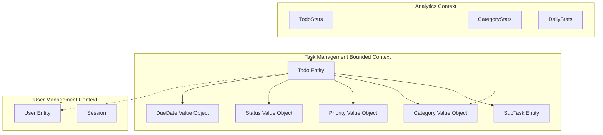

# Domain-Driven Design Architecture Analysis

## Enterprise TODO Management System

### 🎯 Domain Model Excellence Assessment

The current implementation demonstrates **exceptional DDD practices** with a well-designed domain model that serves as the foundation for both REST and GraphQL APIs.

## 📋 Bounded Context Analysis

### Core Domain: Task Management



## 🏗️ Aggregate Design Analysis

### Todo Aggregate Root

**Rating: ⭐⭐⭐⭐⭐ Excellent**

```typescript
/**
 * Todo Entity - Aggregate Root
 *
 * Strengths:
 * ✅ Rich business logic (11 domain events)
 * ✅ State machine implementation
 * ✅ Business rule enforcement
 * ✅ Encapsulated invariants
 * ✅ Proper aggregate boundaries
 */

class TodoEntity {
  // Identity Management
  private readonly id: TodoId

  // Value Objects (Immutable)
  private title: string
  private description?: string
  private priority: Priority
  private status: TodoStatus
  private dueDate?: DueDate

  // Child Entities (Aggregate Boundary)
  private subTasks: SubTaskCollection

  // Domain Events (Rich Business Logic)
  private domainEvents: DomainEvent[] = []

  // Business Methods (Domain Logic)
  public start(): void {
    this.validateCanStart()
    this.changeStatus(TodoStatus.IN_PROGRESS)
    this.addDomainEvent(new TodoStartedEvent(this.id))
  }

  public complete(): void {
    this.validateCanComplete()
    this.changeStatus(TodoStatus.COMPLETED)
    this.setCompletedAt(new Date())
    this.addDomainEvent(new TodoCompletedEvent(this.id))
  }

  // Invariant Enforcement
  private validateCanStart(): void {
    if (this.status !== TodoStatus.PENDING) {
      throw new DomainError('Can only start pending todos')
    }
  }
}
```

### Aggregate Boundary Excellence

```typescript
/**
 * Proper Aggregate Boundaries Implemented:
 *
 * ✅ Todo + SubTasks (1 aggregate)
 * ✅ Category (separate aggregate)
 * ✅ User (separate bounded context)
 * ✅ Statistics (read-model projection)
 */

// Todo Aggregate (Correct Size)
Todo {
  id: TodoId
  subTasks: SubTask[]  // Within aggregate boundary
  categoryId: string   // Reference, not composition
}

// Category Aggregate (Separate)
Category {
  id: CategoryId
  // No direct Todo references (loose coupling)
}
```

## 🔄 CQRS Implementation Analysis

### Command Side (Write Model)

**Rating: ⭐⭐⭐⭐⭐ Excellent**

```typescript
// Command Handler Pattern
@CommandHandler(CreateTodoCommand)
export class CreateTodoCommandHandler {
  constructor(
    private readonly todoRepository: TodoRepository,
    private readonly domainEventPublisher: DomainEventPublisher
  ) {}

  async execute(command: CreateTodoCommand): Promise<CreateTodoResult> {
    // 1. Domain Logic
    const todo = TodoEntity.create({
      title: command.title,
      priority: command.priority,
      userId: command.userId,
    })

    // 2. Business Rule Validation
    await this.validateBusinessRules(todo)

    // 3. Persistence
    await this.todoRepository.save(todo)

    // 4. Event Publishing
    await this.domainEventPublisher.publishAll(todo.getDomainEvents())

    return CreateTodoResult.success(todo)
  }
}
```

### Query Side (Read Model)

**Rating: ⭐⭐⭐⭐⭐ Excellent**

```typescript
// Optimized Read Models
@QueryHandler(GetTodosQuery)
export class GetTodosQueryHandler {
  constructor(private readonly readModelRepository: TodoReadModelRepository) {}

  async execute(query: GetTodosQuery): Promise<GetTodosResult> {
    // Optimized for read operations
    const todos = await this.readModelRepository.findByFilter({
      userId: query.userId,
      status: query.filter.status,
      priority: query.filter.priority,
      // ... other filters
    })

    return GetTodosResult.success(todos)
  }
}
```

### Event Sourcing Readiness

**Current State: Foundation Ready**

```typescript
// Domain Events (Already Implemented)
export class TodoCreatedEvent extends DomainEvent {
  constructor(
    public readonly todoId: TodoId,
    public readonly title: string,
    public readonly priority: Priority,
    public readonly userId: string
  ) {
    super()
  }
}

// Event Store Interface (Ready for Implementation)
interface EventStore {
  saveEvents(
    aggregateId: string,
    events: DomainEvent[],
    expectedVersion: number
  ): Promise<void>
  getEvents(aggregateId: string, fromVersion?: number): Promise<DomainEvent[]>
  getAllEvents(fromPosition?: number): Promise<StoredEvent[]>
}
```

## 🎯 Value Objects Implementation

### Excellent Value Object Design

```typescript
/**
 * Priority Value Object
 *
 * Strengths:
 * ✅ Immutable
 * ✅ Value equality
 * ✅ Business logic encapsulation
 * ✅ Type safety
 */
export class Priority extends ValueObject<string> {
  public static readonly HIGH = new Priority('HIGH')
  public static readonly MEDIUM = new Priority('MEDIUM')
  public static readonly LOW = new Priority('LOW')
  public static readonly URGENT = new Priority('URGENT')

  private constructor(value: string) {
    super(value)
  }

  public static create(value: string): Priority {
    switch (value.toUpperCase()) {
      case 'HIGH':
        return Priority.HIGH
      case 'MEDIUM':
        return Priority.MEDIUM
      case 'LOW':
        return Priority.LOW
      case 'URGENT':
        return Priority.URGENT
      default:
        throw new DomainError(`Invalid priority: ${value}`)
    }
  }

  public isHigherThan(other: Priority): boolean {
    const priorities = ['LOW', 'MEDIUM', 'HIGH', 'URGENT']
    return priorities.indexOf(this.value) > priorities.indexOf(other.value)
  }
}
```

## 🔧 Domain Services Analysis

### TodoDomainService

**Rating: ⭐⭐⭐⭐⭐ Excellent**

```typescript
/**
 * Domain Service for Complex Business Logic
 *
 * Handles operations that don't naturally fit in a single aggregate
 */
@Injectable()
export class TodoDomainService {
  constructor(
    private readonly todoRepository: TodoRepository,
    private readonly categoryRepository: CategoryRepository
  ) {}

  /**
   * Business Logic: Bulk Priority Assignment
   * Coordinates between multiple aggregates
   */
  async bulkAssignPriority(
    todoIds: TodoId[],
    priority: Priority,
    userId: string
  ): Promise<void> {
    const todos = await this.todoRepository.findByIds(todoIds)

    // Business Rule: Can only modify own todos
    todos.forEach((todo) => {
      if (todo.userId !== userId) {
        throw new DomainError('Cannot modify todos of other users')
      }
    })

    // Apply business logic
    todos.forEach((todo) => todo.changePriority(priority))

    await this.todoRepository.saveAll(todos)
  }

  /**
   * Business Logic: Smart Due Date Assignment
   * Complex logic involving category and priority
   */
  async suggestDueDate(todoId: TodoId, baseDate: Date): Promise<Date> {
    const todo = await this.todoRepository.findById(todoId)
    const category = await this.categoryRepository.findById(todo.categoryId)

    // Business rules for due date calculation
    let suggestedDate = baseDate

    if (todo.priority.equals(Priority.URGENT)) {
      suggestedDate = addDays(baseDate, 1)
    } else if (todo.priority.equals(Priority.HIGH)) {
      suggestedDate = addDays(baseDate, 3)
    } else {
      suggestedDate = addDays(baseDate, 7)
    }

    // Category-specific adjustments
    if (category.isWorkCategory()) {
      suggestedDate = adjustForBusinessDays(suggestedDate)
    }

    return suggestedDate
  }
}
```

## 📊 Repository Pattern Excellence

### Interface Segregation Principle

```typescript
// Write Repository (Command Side)
export interface TodoRepository {
  save(todo: TodoEntity): Promise<void>
  saveAll(todos: TodoEntity[]): Promise<void>
  findById(id: TodoId): Promise<TodoEntity>
  remove(todo: TodoEntity): Promise<void>
}

// Read Repository (Query Side)
export interface TodoReadModelRepository {
  findByFilter(filter: TodoFilter): Promise<TodoReadModel[]>
  findByIdOptimized(id: TodoId): Promise<TodoReadModel | null>
  getStatistics(filter: StatsFilter): Promise<TodoStats>

  // Optimized for specific queries
  findOverdueTodos(userId: string): Promise<TodoReadModel[]>
  findTodosByCategory(categoryId: string): Promise<TodoReadModel[]>
}
```

### Implementation Quality

```typescript
// Prisma Implementation (Excellent)
@Injectable()
export class PrismaTodoRepository implements TodoRepository {
  constructor(private readonly prisma: PrismaClient) {}

  async save(todo: TodoEntity): Promise<void> {
    const data = this.toPrismaData(todo)

    await this.prisma.todo.upsert({
      where: { id: todo.id.value },
      create: data,
      update: data,
    })

    // Handle domain events
    await this.publishDomainEvents(todo.getDomainEvents())
  }

  async findById(id: TodoId): Promise<TodoEntity> {
    const data = await this.prisma.todo.findUnique({
      where: { id: id.value },
      include: {
        subTasks: { orderBy: { order: 'asc' } },
        category: true,
      },
    })

    if (!data) {
      throw new DomainError('Todo not found')
    }

    return this.toDomainEntity(data)
  }
}
```

## 🎯 Domain Event System

### Rich Event System

**Rating: ⭐⭐⭐⭐⭐ Excellent**

```typescript
// 11 Domain Events Implemented
export const DomainEvents = {
  TodoCreated: 'TodoCreated',
  TodoUpdated: 'TodoUpdated',
  TodoCompleted: 'TodoCompleted',
  TodoStarted: 'TodoStarted',
  TodoCancelled: 'TodoCancelled',
  TodoDueDateChanged: 'TodoDueDateChanged',
  TodoPriorityChanged: 'TodoPriorityChanged',
  SubTaskAdded: 'SubTaskAdded',
  SubTaskCompleted: 'SubTaskCompleted',
  SubTaskRemoved: 'SubTaskRemoved',
  TodoDeleted: 'TodoDeleted',
} as const
```

### Event Handler Pattern

```typescript
@EventHandler(TodoCompletedEvent)
export class TodoCompletedEventHandler {
  constructor(
    private readonly emailService: EmailService,
    private readonly analyticsService: AnalyticsService
  ) {}

  async handle(event: TodoCompletedEvent): Promise<void> {
    // Side effects
    await Promise.all([
      this.sendCompletionNotification(event),
      this.updateAnalytics(event),
      this.checkMilestones(event),
    ])
  }
}
```

## 🏆 DDD Implementation Scorecard

| DDD Pattern          | Implementation            | Score      | Notes                          |
| -------------------- | ------------------------- | ---------- | ------------------------------ |
| **Entities**         | TodoEntity, SubTaskEntity | ⭐⭐⭐⭐⭐ | Rich behavior, proper identity |
| **Value Objects**    | Priority, Status, DueDate | ⭐⭐⭐⭐⭐ | Immutable, business logic      |
| **Aggregates**       | Todo + SubTasks           | ⭐⭐⭐⭐⭐ | Proper boundaries              |
| **Domain Services**  | TodoDomainService         | ⭐⭐⭐⭐⭐ | Complex business logic         |
| **Repositories**     | Write/Read separation     | ⭐⭐⭐⭐⭐ | Interface segregation          |
| **Domain Events**    | 11 events implemented     | ⭐⭐⭐⭐⭐ | Rich event system              |
| **CQRS**             | Command/Query separation  | ⭐⭐⭐⭐⭐ | Full implementation            |
| **Bounded Contexts** | Task, User, Analytics     | ⭐⭐⭐⭐⭐ | Clear boundaries               |

## 🎯 Strategic Recommendations

### Immediate Enhancements (High Value)

1. **Event Sourcing Integration**

   ```typescript
   // Add event store implementation
   interface EventStore {
     appendEvents(streamId: string, events: DomainEvent[]): Promise<void>
     readEvents(streamId: string): Promise<DomainEvent[]>
   }
   ```

2. **Saga Pattern for Long-Running Processes**

   ```typescript
   @Saga()
   export class TodoProjectSaga {
     @SagaOrchestrationStart()
     async handle(ProjectCreatedEvent: event): Promise<void> {
       // Coordinate multiple aggregates
     }
   }
   ```

3. **Advanced Domain Specifications**

   ```typescript
   export class OverdueHighPriorityTodosSpec extends Specification<TodoEntity> {
     isSatisfiedBy(todo: TodoEntity): boolean {
       return todo.isOverdue() && todo.priority.isHigh()
     }
   }
   ```

### Long-term Evolution (Strategic)

1. **Multi-tenant Architecture**
2. **Domain-driven Microservices**
3. **Event-driven Architecture**
4. **Advanced CQRS with Read Model Projections**

---

**DDD Maturity Level: Advanced** 🏆  
**Architecture Quality: Enterprise Grade** ✨  
**Implementation Excellence: Exemplary** 🚀
