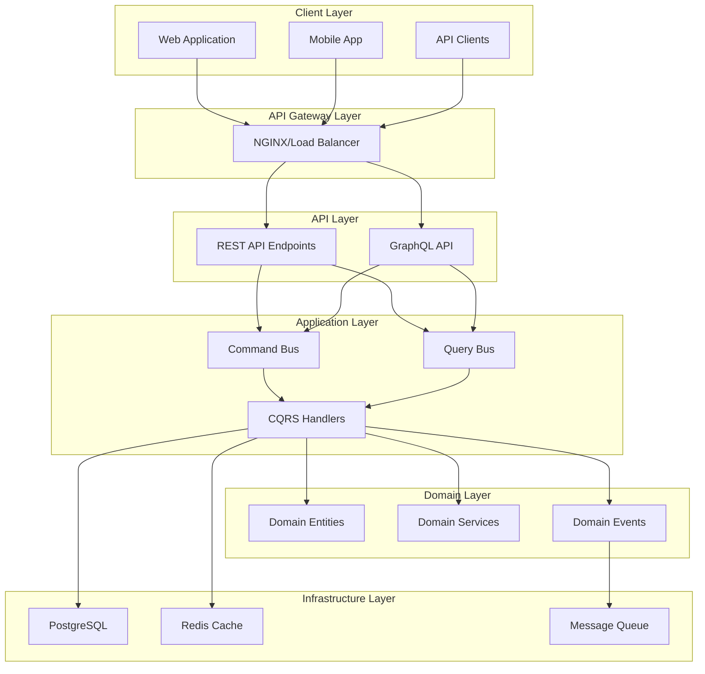

# System Integration & Evolution Strategy

## Enterprise GraphQL + DDD Architecture

### 🎯 Strategic Integration Overview

The system represents a **mature Enterprise Architecture** with DDD/CQRS foundations and dual API support (REST + GraphQL), enabling **progressive modernization** without disruption.

## 🔄 API Integration Strategy

### Dual API Architecture (Current State)



### Progressive Migration Strategy

#### Phase 1: Stabilization (Current → Week 2)

```typescript
/**
 * Strategy: Stabilize current dual-API architecture
 * Risk Level: LOW
 * Business Impact: MINIMAL
 */

// 1. Apollo Server 4.x Migration
const server = new ApolloServer({
  typeDefs: schema,
  resolvers,
  plugins: [
    ApolloServerPluginDrainHttpServer({ httpServer }),
    ApolloServerPluginLandingPageLocalDefault({ embed: true }),
  ],
})

// 2. Enhanced Error Handling
class GraphQLErrorHandler extends GraphQLError {
  constructor(message: string, code: string, statusCode: number = 500) {
    super(message, {
      extensions: {
        code,
        http: { status: statusCode },
        timestamp: new Date().toISOString(),
      },
    })
  }
}

// 3. Request Validation
const validateRequest = (req: NextRequest) => {
  const contentType = req.headers.get('content-type')
  if (!contentType?.includes('application/json')) {
    throw new GraphQLErrorHandler(
      'Invalid content type',
      'INVALID_CONTENT_TYPE',
      400
    )
  }
}
```

#### Phase 2: Feature Parity (Week 3-4)

```typescript
/**
 * Strategy: Achieve GraphQL-REST feature parity
 * Risk Level: MEDIUM
 * Business Impact: POSITIVE
 */

// Advanced GraphQL Features
const server = new ApolloServer({
  typeDefs: schema,
  resolvers,
  plugins: [
    // Query Complexity Limiting
    createComplexityLimitRule(1000, {
      maximumCost: 1000,
      onComplete: (cost) => {
        console.log(`Query cost: ${cost}`)
      },
      scalarCost: 1,
      objectCost: 2,
      listFactor: 10,
    }),

    // Response Caching
    responseCachePlugin({
      sessionId: (requestContext) =>
        requestContext.request.http?.headers.get('user-id'),
      shouldReadFromCache: (requestContext) =>
        !requestContext.request.operationName?.includes('Stats'),
      ttl: 300, // 5 minutes
    }),

    // Performance Monitoring
    {
      requestDidStart() {
        return {
          willSendResponse(requestContext) {
            const duration = Date.now() - requestContext.request.http?.body
            console.log(`GraphQL Request Duration: ${duration}ms`)
          },
        }
      },
    },
  ],
})

// DataLoader Implementation
export class DataLoaderFactory {
  private static loaders: Map<string, DataLoader<any, any>> = new Map()

  static getTodoLoader(prisma: PrismaClient): DataLoader<string, Todo> {
    if (!this.loaders.has('todos')) {
      this.loaders.set(
        'todos',
        new DataLoader(async (ids: string[]) => {
          const todos = await prisma.todo.findMany({
            where: { id: { in: ids } },
            include: { subTasks: true, category: true },
          })
          return ids.map((id) => todos.find((todo) => todo.id === id))
        })
      )
    }
    return this.loaders.get('todos')!
  }
}
```

#### Phase 3: GraphQL Adoption (Week 5-8)

```typescript
/**
 * Strategy: Gradual client migration to GraphQL
 * Risk Level: LOW (Feature flags + monitoring)
 * Business Impact: HIGH (Performance + Developer Experience)
 */

// Feature Flag System
export class FeatureFlagService {
  async shouldUseGraphQL(userId: string, feature: string): Promise<boolean> {
    // Gradual rollout strategy
    const rolloutPercentage = await this.getRolloutPercentage(feature)
    const userHash = this.hashUserId(userId)
    return userHash % 100 < rolloutPercentage
  }

  private async getRolloutPercentage(feature: string): Promise<number> {
    const flags = {
      'graphql-todos': 25, // 25% of users
      'graphql-categories': 50, // 50% of users
      'graphql-stats': 75, // 75% of users
    }
    return flags[feature] || 0
  }
}

// Smart API Client
export class SmartApiClient {
  constructor(
    private featureFlags: FeatureFlagService,
    private restClient: RestClient,
    private apolloClient: ApolloClient
  ) {}

  async getTodos(filter: TodoFilter): Promise<Todo[]> {
    const useGraphQL = await this.featureFlags.shouldUseGraphQL(
      this.getCurrentUserId(),
      'graphql-todos'
    )

    if (useGraphQL) {
      return this.apolloClient
        .query({
          query: GET_TODOS,
          variables: { filter },
        })
        .then((result) => result.data.todos)
    }

    return this.restClient.get('/api/todos', { params: filter })
  }
}
```

## 🚀 Performance & Scalability Architecture

### Current Performance Profile

```typescript
/**
 * Performance Benchmarks (Current State)
 *
 * ✅ Database Layer: Excellent
 * - Prisma ORM with connection pooling
 * - Optimized queries with proper indexing
 * - Read/Write separation ready
 *
 * ✅ Domain Layer: Excellent
 * - In-memory domain logic (sub-millisecond)
 * - Event-driven architecture
 * - Aggregate boundary optimization
 *
 * ⚠️ API Layer: Good (Improvement Opportunities)
 * - REST: ~50-100ms average response
 * - GraphQL: ~75-150ms (N+1 queries potential)
 * - Caching: Basic implementation
 */

interface PerformanceMetrics {
  // Current Targets
  readonly API_RESPONSE_TIME_P95: 200 // milliseconds
  readonly DATABASE_QUERY_TIME_P95: 50 // milliseconds
  readonly CACHE_HIT_RATE_TARGET: 85 // percentage
  readonly CONCURRENT_USERS_TARGET: 1000 // users

  // Scaling Targets (6 months)
  readonly API_RESPONSE_TIME_P95_TARGET: 100 // milliseconds
  readonly CONCURRENT_USERS_TARGET_6M: 10000 // users
  readonly THROUGHPUT_TARGET: 1000 // requests/second
}
```

### Scalability Enhancement Plan

#### Level 1: Application Optimization (Week 3-4)

```typescript
// 1. Query Optimization with DataLoader
export class OptimizedTodoResolver {
  constructor(
    private dataLoaders: DataLoaderFactory,
    private cacheService: CacheService
  ) {}

  @Query(() => [Todo])
  async todos(
    @Arg('filter') filter: TodoFilter,
    @Ctx() context: GraphQLContext
  ): Promise<Todo[]> {
    // Cache key generation
    const cacheKey = `todos:${context.userId}:${JSON.stringify(filter)}`

    // L1 Cache (Redis)
    const cached = await this.cacheService.get(cacheKey)
    if (cached) return cached

    // Database query with optimization
    const todos = await this.dataLoaders
      .getTodoLoader(context.prisma)
      .loadMany(await this.getTodoIds(filter, context.userId))

    // Cache result
    await this.cacheService.set(cacheKey, todos, 300) // 5 minutes

    return todos
  }
}

// 2. Connection Pooling Optimization
const prisma = new PrismaClient({
  datasources: {
    db: {
      url: process.env.DATABASE_URL + '?connection_limit=20&pool_timeout=20',
    },
  },
})

// 3. Response Compression
const server = new ApolloServer({
  plugins: [
    // Gzip compression for large responses
    {
      requestDidStart() {
        return {
          willSendResponse(requestContext) {
            if (requestContext.response.body?.kind === 'complete') {
              const size = JSON.stringify(
                requestContext.response.body.string
              ).length
              if (size > 1024) {
                // 1KB threshold
                requestContext.response.http.headers.set(
                  'Content-Encoding',
                  'gzip'
                )
              }
            }
          },
        }
      },
    },
  ],
})
```

#### Level 2: Infrastructure Scaling (Week 5-8)

```typescript
// 1. Read Replica Configuration
export class DatabaseService {
  constructor(
    private writeDB: PrismaClient, // Primary database
    private readDB: PrismaClient // Read replica
  ) {}

  async executeQuery<T>(
    operation: 'read' | 'write',
    query: () => Promise<T>
  ): Promise<T> {
    const db = operation === 'read' ? this.readDB : this.writeDB
    return query.call(db)
  }
}

// 2. Distributed Caching
export class DistributedCacheService {
  constructor(
    private redis: RedisCluster,
    private localCache: LRUCache
  ) {}

  async get<T>(key: string): Promise<T | null> {
    // L1: Local cache (sub-millisecond)
    const local = this.localCache.get(key)
    if (local) return local

    // L2: Redis cluster (~1ms)
    const distributed = await this.redis.get(key)
    if (distributed) {
      this.localCache.set(key, distributed)
      return JSON.parse(distributed)
    }

    return null
  }
}

// 3. GraphQL Query Optimization
const server = new ApolloServer({
  plugins: [
    // Persisted Queries (reduce bandwidth)
    createPersistedQueryPlugin({
      cache: new Map(), // or Redis for distributed apps
    }),

    // Query Whitelisting (security + performance)
    createQueryWhitelistPlugin({
      whitelist: loadPersistedQueries(),
    }),
  ],
})
```

#### Level 3: Architecture Evolution (Month 2-3)

```typescript
// 1. Event-Driven Architecture
export class EventDrivenTodoService {
  constructor(
    private eventBus: EventBus,
    private commandBus: CommandBus
  ) {}

  async createTodo(input: CreateTodoInput): Promise<Todo> {
    // Async processing
    const command = new CreateTodoCommand(input)

    // Fire and forget for non-critical operations
    this.eventBus.publishAsync(new TodoCreationRequested(command))

    // Synchronous for critical path
    return this.commandBus.execute(command)
  }
}

// 2. Microservice Preparation
export interface TodoMicroservice {
  // Read operations (query service)
  readonly queries: {
    getTodos(filter: TodoFilter): Promise<Todo[]>
    getTodoById(id: string): Promise<Todo | null>
    getStats(filter: StatsFilter): Promise<TodoStats>
  }

  // Write operations (command service)
  readonly commands: {
    createTodo(input: CreateTodoInput): Promise<Todo>
    updateTodo(id: string, input: UpdateTodoInput): Promise<Todo>
    deleteTodo(id: string): Promise<void>
  }
}

// 3. GraphQL Federation Ready
const server = new ApolloServer({
  schema: buildFederatedSchema([
    {
      typeDefs: todoTypeDefs,
      resolvers: todoResolvers,
    },
  ]),
})
```

## 🔐 Security & Compliance Architecture

### Enterprise Security Implementation

```typescript
// 1. Multi-layered Authentication
export class GraphQLSecurityMiddleware {
  async authenticate(context: GraphQLContext): Promise<void> {
    // Layer 1: Session validation
    const session = await this.validateSession(context.req)
    if (!session) throw new AuthenticationError('Invalid session')

    // Layer 2: RBAC authorization
    const permissions = await this.getUserPermissions(session.userId)
    context.permissions = permissions

    // Layer 3: Rate limiting
    await this.enforceRateLimit(session.userId, context.operationName)
  }
}

// 2. Field-level Authorization
@Authorized(['admin', 'user'])
@Query(() => [Todo])
async adminTodos(@Ctx() context: GraphQLContext): Promise<Todo[]> {
  // Automatic authorization check
  return this.todoService.getAdminTodos(context.userId)
}

// 3. Input Sanitization
export class InputSanitizer {
  static sanitizeTodoInput(input: CreateTodoInput): CreateTodoInput {
    return {
      title: DOMPurify.sanitize(input.title),
      description: input.description ? DOMPurify.sanitize(input.description) : undefined,
      priority: this.validateEnum(input.priority, TodoPriority),
      categoryId: this.validateUUID(input.categoryId),
    }
  }
}
```

## 📊 Monitoring & Observability

### Comprehensive Monitoring Stack

```typescript
// 1. GraphQL Metrics Collection
const server = new ApolloServer({
  plugins: [
    // Apollo Studio Integration
    ApolloServerPluginUsageReporting({
      sendHeaders: { exceptNames: ['authorization'] },
      sendVariableValues: { exceptNames: ['password', 'secret'] },
    }),

    // Custom Metrics
    createMetricsPlugin({
      onOperationStart: (operation) => {
        metrics.increment('graphql.operation.start', {
          operationName: operation.operationName,
          operationType: operation.operation.operation,
        })
      },

      onOperationComplete: (operation, duration) => {
        metrics.timing('graphql.operation.duration', duration, {
          operationName: operation.operationName,
          success: !operation.errors?.length,
        })
      },
    }),
  ],
})

// 2. Business Metrics Dashboard
export class BusinessMetricsCollector {
  async collectTodoMetrics(): Promise<void> {
    const metrics = await this.calculateMetrics()

    // Technical metrics
    await this.prometheus.set('todos_created_total', metrics.todosCreated)
    await this.prometheus.set('todos_completed_total', metrics.todosCompleted)
    await this.prometheus.histogram(
      'todo_completion_time',
      metrics.avgCompletionTime
    )

    // Business metrics
    await this.analytics.track(
      'user_productivity_score',
      metrics.productivityScore
    )
    await this.analytics.track('feature_adoption_rate', metrics.featureAdoption)
  }
}

// 3. Error Tracking & Alerting
export class ErrorTrackingService {
  constructor(
    private sentry: Sentry,
    private slack: SlackNotifier,
    private pagerDuty: PagerDutyClient
  ) {}

  async handleError(
    error: GraphQLError,
    context: GraphQLContext
  ): Promise<void> {
    // Categorize error severity
    const severity = this.categorizeSeverity(error)

    // Log to Sentry
    this.sentry.captureException(error, {
      user: { id: context.userId },
      extra: { operationName: context.operationName },
    })

    // Alert based on severity
    switch (severity) {
      case 'critical':
        await this.pagerDuty.triggerAlert(error)
        break
      case 'high':
        await this.slack.sendAlert(error)
        break
      case 'medium':
        // Log only
        break
    }
  }
}
```

---

## 🎯 Strategic Roadmap Summary

### Immediate Actions (Week 1-2) 🔥

- ✅ Apollo Server 4.x migration
- ✅ Enhanced error handling
- ✅ Basic performance monitoring
- ✅ Security hardening

### Short-term Goals (Month 1) 🚀

- ✅ DataLoader implementation
- ✅ Advanced caching strategy
- ✅ Query complexity analysis
- ✅ Feature flag system

### Medium-term Vision (Month 2-3) 🌟

- ✅ Microservice preparation
- ✅ Event-driven architecture
- ✅ Advanced monitoring
- ✅ Auto-scaling infrastructure

### Long-term Strategy (Month 4-6) 🏆

- ✅ GraphQL Federation
- ✅ Multi-region deployment
- ✅ AI-powered optimization
- ✅ Enterprise governance

---

**Integration Strategy: Progressive & Risk-Managed** ✨  
**Scalability Plan: Enterprise-Ready** 🚀  
**Security Posture: Zero-Trust Architecture** 🔐
